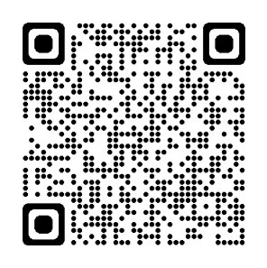

# Nova-HackUAQ EASYLAWYER

---

## Descripción

El proyecto es una plataforma. 


---
Proyecto desplegado en: Microsoft Azure

Enlace del proyecto: [EasyLawyers](https://delightful-plant-0e77d3c0f.3.azurestaticapps.net) (https://delightful-plant-0e77d3c0f.3.azurestaticapps.net)

<div>

</div>

## Instrucciones

Para replicar este proyecto, sigue cada uno de los pasos:
1. Descargar el archivo Zip ó Clonar el proyecto con: 
```bash:
git clone https://github.com/earias12/Nova-HackUAQ.git
```
2. Abrir la carpeta clonada.
3. Buscar la carpeta llamada ***src/***.
4. Ejecutar el archivo ***index.html*** ó usando live server para abrir los archivos que se encuentran dentro de ***src/***.


---
## Equipo

- Evelyn Arias
- Manuel Ortiz
- Krishna Herrera
- Salvador Rojas
- Brian Poulsen
